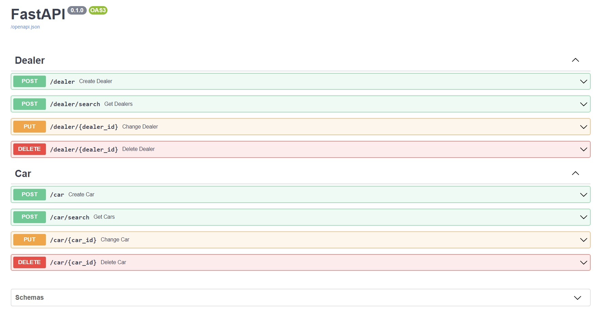

### Description

cars is a simple API for interaction with the information on dealers and cars. 

API supports the following operations: 
- creating instance of dealers and cars;
- search the information on dealers and cars;
- update the information on dealers and cars;
- delete the dealers and cars.

### Prerequisites

#### there is two ways to run api: by using docker [recommended] or run itself

#### Run API by using docker:
- install Docker and Docker-Compose.
- move to the project root directory
- run the docker container: `$ docker-compose up --build -d`
- wait for the docker to start. It may take a minute
- open the browser
- insert the next address in browser: `http://localhost:8000/docs#`
- you will see the swagger window: 



- run sql script with the data for the experiments:

`$ docker exec -i db /bin/bash -c "PGPASSWORD=1234 psql --username postgres cars" < dump.sql`

#### Run API without docker:
- install postgres
- create database 'cars' with the next parameters:

`database username: postgres`

`database password: 1234`

`database name: cars`

- move to the project root directory
- run command: `$ alembic upgrade head`
- run api: `$ uvicorn src.app:app`
- open the browser
- insert the next address in browser: `http://localhost:8000/docs#`
- you will see the swagger window (see above):
- run sql script with the data for the experiments (you can do this in any convenient way (for example by using pgadmin) or do it as follows):

    - open sql shell (psql)
    - enter the following commands:
    
    `Server [localhost]: localhost`
    
    `Database [postgres]: cars`
    
    `Port [5432]: 5432`
    
    `Username [postgres]: postgres`
    
    `password: 1234`
    
    - insert sql expressions from the file dump.sql in the project root directory
    
### To run the tests, do the next steps:
- move to the project root directory
- run the next command: `$ pytest`

### Examples of usage:

<details><summary><h2>Endpoints:</h2></summary>

<hr>
<details><summary><h4>Create Dealer</h4></summary>

##### Description: creates a dealer with the specified parameters

##### URL: http://localhost:8000/dealer

##### Request:

- ````
    curl -X 'POST' \
      'http://localhost:8000/dealer' \
      -H 'accept: application/json' \
      -H 'Content-Type: application/json' \
      -d '{
      "dealer_name": "string",
      "address": "string",
      "phone": "string"
    }'
  ````

##### Responses:
- Successful Response:
  - status code: 201
  - Response body: 
      ````
      {"detail": "created"}
      ````
- Error: Conflict:

  - status code: 409
  - Response body:
      ````
      {"detail": "(psycopg2.errors.UniqueViolation) duplicate key value violates unique constraint \"dealer_dealer_name_key\"\nDETAIL:  Key (dealer_name)=(ee) already exists.\n\n[SQL: INSERT INTO dealer (dealer_name, address, phone) VALUES (%(dealer_name)s, %(address)s, %(phone)s) RETURNING dealer.id]\n[parameters: {'dealer_name': 'ee', 'address': 'string', 'phone': 'string'}]\n(Background on this error at: https://sqlalche.me/e/14/gkpj)"}
      ````
    
##### Note: field dealer_name should be unique

##### JSON Schema:
    {
      "type": "object",
      "properties": {
        "dealer_name": {
          "type": "string"
        },
        "address": {
          "type": "string"
        },
        "phone": {
          "type": "string"
        }
      },
      "required": [
        "dealer_name"
      ]
    }
    
</details>

<hr>
<details><summary><h4>Get Dealers</h4></summary>

##### Description: search for dealers by specified parameters

##### URL: http://localhost:8000/dealer/search

##### Request (to get all dealers): 
- ````
    curl -X 'POST' \
      'http://localhost:8000/dealer/search' \
      -H 'accept: application/json' \
      -H 'Content-Type: application/json' \
      -d '{
    }'
    ````

##### Response:
- status code: 200
- Response body:
    ````
    [
      {
        "address": "357 Philip Heights Apt. 877 New Stephanie, SD 66159",
        "phone": "14155552671",
        "id": 1,
        "dealer_name": "VROOM"
      },
      {
        "address": "13245 Sullivan Mount Suite 489 Bryanborough, ME 94533",
        "phone": "14187581856",
        "id": 2,
        "dealer_name": "Carvana"
      }
    ]
    ````

    
##### Request (to get specified dealer):
- ````
    curl -X 'POST' \
      'http://localhost:8000/dealer/search' \
      -H 'accept: application/json' \
      -H 'Content-Type: application/json' \
      -d '{
      "id": 1,
      "dealer_name": "VROOM"
    }'
    ````
##### Response:
- status code: 200
- Response body:
- ````
    [
      {
        "address": "357 Philip Heights Apt. 877 New Stephanie, SD 66159",
        "phone": "14155552671",
        "id": 1,
        "dealer_name": "VROOM"
      }
    ]
    ````
##### Note - if there is not any dealers, the response will be:
- status code: 200
- Response body:
- ````
  []
  ````
##### JSON Schema:
    {
      "type": "object",
      "properties": {
        "id": {
          "type": "integer"
        },
        "dealer_name": {
          "type": "string"
        },
        "address": {
          "type": "string"
        },
        "phone": {
          "type": "string"
        }
      }
    }

</details>

<hr>
<details><summary><h4>Change Dealer</h4></summary>

##### Description: change dealer according to parameters

##### URL: http://localhost:8000/dealer/<dealer_id>

##### Request:
    ````
    curl -X 'PUT' \
      'http://localhost:8000/dealer/179' \
      -H 'accept: application/json' \
      -H 'Content-Type: application/json' \
      -d '{
      "dealer_name": "rr",
      "address": "string",
      "phone": "string"
    }'
    ````
##### Responses:
- Successful Response:
    - status code: 200
    - Response body:
    ````
    {"detail": "changed"}
    ````
- Error: Conflict
    - status code: 409
    - Response body:
    ````
    {"detail": "(psycopg2.errors.UniqueViolation) duplicate key value violates unique constraint \"dealer_dealer_name_key\"\nDETAIL:  Key (dealer_name)=(string) already exists.\n\n[SQL: UPDATE dealer SET dealer_name=%(dealer_name)s WHERE dealer.id = %(dealer_id)s]\n[parameters: {'dealer_name': 'string', 'dealer_id': 179}]\n(Background on this error at: https://sqlalche.me/e/14/gkpj)"}
    ````
  
##### JSON Schema:
    {
      "type": "object",
      "properties": {
        "dealer_name": {
          "type": "string"
        },
        "address": {
          "type": "string"
        },
        "phone": {
          "type": "string"
        }
      }
    }
  
</details>

<hr>
<details><summary><h4>Delete Dealer</h4></summary>

##### URL: http://localhost:8000/dealer/<dealer_id>

##### Request:
````
curl -X 'DELETE' \
  'http://localhost:8000/dealer/1' \
  -H 'accept: application/json'
````
##### Responses:
- Successful Response:
    - status code: 200
    - Response body:
    ````
    {"detail": "deleted"}
    ````
- Error: Not Found
    - status code: 404
    - Response body:
    ````
    {"detail": "dealer with this ID doesn't exist"}
    ````
- Error: Conflict
  - status code: 409
  - Response body:
  ````
  {"detail": "(psycopg2.errors.ForeignKeyViolation) update or delete on table \"dealer\" violates foreign key constraint \"car_dealer_id_fkey\" on table \"car\"\nDETAIL:  Key (id)=(105) is still referenced from table \"car\".\n\n[SQL: DELETE FROM dealer WHERE dealer.id = %(id)s]\n[parameters: {'id': 105}]\n(Background on this error at: https://sqlalche.me/e/14/gkpj)"}
  ````
##### Note: For security reasons, it is forbidden to remove dealers who have cars. In this case, you will receive a response with the code 409 (see above)

</details>

<hr>
<details><summary><h4>Create Car</h4></summary>

##### Description: creates a car with the specified parameters

##### URL: http://localhost:8000/car

##### Request:
- ````
    curl -X 'POST' \
      'http://localhost:8000/car' \
      -H 'accept: application/json' \
      -H 'Content-Type: application/json' \
      -d '{
      "model": "string",
      "dealer_id": 1
    }'
    ````
##### Responses:
- Successful Response:
  - status code: 201
  - Response body:
  - ````
    {"detail": "created"}
    ````
 
- Error: Not Found
  - status code: 404
  - Response body:
  - ````
    {"detail": "dealer with this ID doesn't exist"}
    ````

##### JSON Schema
    {
      "type": "object",
      "properties": {
        "model": {
          "type": "string"
        },
        "year": {
          "type": "integer"
        },
        "color": {
          "type": "string"
        },
        "mileage": {
          "type": "integer"
        },
        "price": {
          "type": "integer"
        },
        "dealer_id": {
          "type": "integer"
        }
      },
      "required": [
        "model",
        "dealer_id"
      ]
    }
    
    
</details>

<hr>
<details><summary><h4>Get Cars</h4></summary>

##### Description: search for cars by specified parameters

##### URL: http://localhost:8000/car/search

##### Request (to get all cars):
````
curl -X 'POST' \
  'http://localhost:8000/car/search' \
  -H 'accept: application/json' \
  -H 'Content-Type: application/json' \
  -d '{}'
````
##### Response:
- status code: 201
- Response body:
````
[
  {
    "model": "Focus S",
    "year": 2011,
    "mileage": 85000,
    "price": 7995,
    "id": 1,
    "color": "Blue Flame Metallic",
    "dealer_id": 1
  },
  {
    "model": "Focus S",
    "year": 2015,
    "mileage": 45000,
    "price": 18000,
    "id": 2,
    "color": "Blue Flame Metallic",
    "dealer_id": 2
  },
  {
    "model": "Nissan Frontier SV",
    "year": 2020,
    "mileage": 41209,
    "price": 26391,
    "id": 3,
    "color": "Steel",
    "dealer_id": 2
  }
]
````
##### Request (to get specified car):
````
curl -X 'POST' \
  'http://localhost:8000/car/search' \
  -H 'accept: application/json' \
  -H 'Content-Type: application/json' \
  -d '{
  "id": 1
}'
````
##### Response:
- status code: 200
- Response body
    ````
    [
      {
        "model": "Focus S",
        "year": 2011,
        "mileage": 85000,
        "price": 7995,
        "id": 1,
        "color": "Blue Flame Metallic",
        "dealer_id": 1
      }
    ]
    ````
##### Note - if there is not any cars, the response will be:
- status code: 200
- Response body:
- ````
  []
  ````
  
##### JSON Schema:
    {
      "type": "object",
      "properties": {
        "model": {
          "type": "string"
        },
        "year": {
          "type": "integer"
        },
        "color": {
          "type": "string"
        },
        "mileage": {
          "type": "integer"
        },
        "price": {
          "type": "integer"
        },
        "dealer_id": {
          "type": "integer"
        }
      }
    }
  
</details>

<hr>
<details><summary><h4>Change Car</h4></summary>

##### Description: change car according to parameters

##### URL: http://localhost:8000/car/<car_id>

##### Request:
````
curl -X 'PUT' \
  'http://localhost:8000/car/26' \
  -H 'accept: application/json' \
  -H 'Content-Type: application/json' \
  -d '{
  "model": "string",
  "dealer_id": 105
}'
````
##### Responses:
- Successful Response:
  - status code: 200
  - Response body:
  ````
  {"detail": "changed"}
  ````
- Error: Not Found (example 1)
  - status code: 404
  - Response body
  ````
  {"detail": "car with this ID doesn't exist"}
  ````
  
- Error: Not Found (example 2)
  - status code: 404
  - Response body
  ````
  {"detail": "dealer with this ID doesn't exist"}
  ````
##### JSON Schema
    {
      "$schema": "http://json-schema.org/draft-04/schema#",
      "type": "object",
      "properties": {
        "model": {
          "type": "string"
        },
        "year": {
          "type": "integer"
        },
        "color": {
          "type": "string"
        },
        "mileage": {
          "type": "integer"
        },
        "price": {
          "type": "integer"
        },
        "dealer_id": {
          "type": "integer"
        }
      }
    }
  
</details>

<hr>
<details><summary><h4>Delete Car</h4></summary>

##### URL: http://localhost:8000/car/<car_id>

##### Request:
````
curl -X 'DELETE' \
  'http://localhost:8000/car/26' \
  -H 'accept: application/json'
````
##### Response:
- Successful Response:
  - status code: 200
  - Response body:
    ````
    {"detail": "deleted"}
    ````
- Error: Not Found
  - status code: 404
  - Response body:
  ````
  {"detail": "car with this ID doesn't exist"}
  ````
  
</details>
</details>


